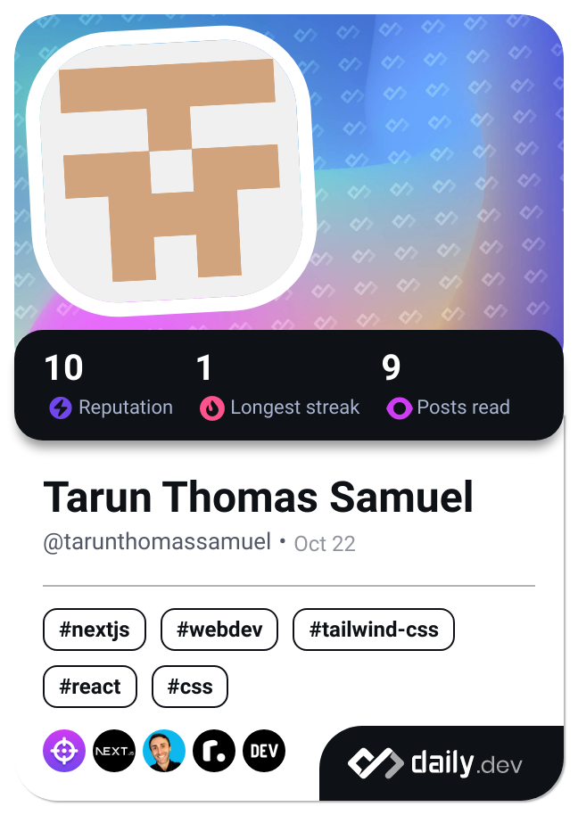

#### Hi there, I'm [Tarun Samuel][website] 👋

### Languages and Tools 🛠:
[][html]
[][css3]
[][js] 
[][react]
[][redux]
[][saas]
[][tailwind]

 
 

[website]: https://tarunsamuel7.github.io/
[vscode]: https://code.visualstudio.com/download
[html]: https://html.com/
[css3]: https://www.w3schools.com/css/
[nodejs]: https://nodejs.org/en/
[saas]: https://sass-lang.com/
[js]: https://www.javascript.com/
[react]: https://reactjs.org/
[git]: https://git-scm.com/
[tailwind]: https://tailwindcss.com/
[redux]: https://redux.js.org/
[firebase]: https://firebase.google.com/

<!--
**tarunsamuel7/tarunsamuel7** is a ✨ _special_ ✨ repository because its `README.md` (this file) appears on your GitHub profile.

Here are some ideas to get you started:

- 🔭 I’m currently working on ...
- 🌱 I’m currently learning ...
- 👯 I’m looking to collaborate on ...
- 🤔 I’m looking for help with ...
- 💬 Ask me about ...
- 📫 How to reach me: ...
- 😄 Pronouns: ...
- ⚡ Fun fact: ...
-->

